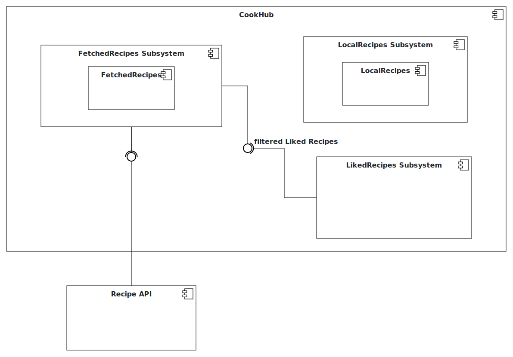

# Intro Course Project App of <yourname> for the iPraktikum

To pass the intro course, you need to create your own unique iOS app (based on SwiftUI).

There are no requirements regarding the functions of your app, so you can get creative.
However, we provide you with Non-Functional Requirements (NFR) that your app needs to fulfill.

After each day of learning new Swift and SwiftUI concepts, these NFRs may change, or new NFRs get added.

## Submission procedure

You get a **personal repository** on Gitlab to work on your app.

Once you implemented a new feature into your app, you need to create a Merge Request (MR - Sometimes we will also reference these as "Pull Requests"(PR)) to merge your changes from the feature branch into your main branch.

Your tutor will review your changes and either request changes or approves the MR.

If your MR got approved, you also need to merge it!

### Deadline: **17.10.2023 23:59**

Until the deadline all of your PRs **need to be merged** and your final app **needs to fulfill** all of the requested NFRs!

---

## Problem Statement (max. 500 words)

Problem Statement

In today's fast-paced world, many individuals and families struggle with the challenge of planning and preparing delicious, home-cooked meals that suit their dietary preferences and nutritional needs. Cooking at home is thought to be time-consuming, and difficult. Hence why, people frequently resort to unhealthy, costly takeout options or pre-packaged foods. This problem could be tackled by a user-friendly, and resourcefull app. This is where CookHub, a recipe app, seeks to make a difference.

Lack of Time for Meal Planning and Preparation:
One of the primary problems that CookHub aims to tackle is the time constraints that individuals face in their daily lives. Balancing work, family, and other responsibilities leaves limited time for meal planning, grocery shopping, and cooking. This time pressure often leads to unhealthy food choices and a reliance on fast food and takeout. CookHub aims to provide a solution by offering a curated collection of quick and easy recipes that fit into busy schedules, helping users save time and still enjoy homemade meals.
Limited Culinary Knowledge and Confidence:
Many people are intimidated by the thought of cooking at home, fearing that they lack the culinary skills required to prepare a tasty meal. This lack of confidence in the kitchen often prevents individuals from exploring new recipes and cuisines. CookHub is designed to bridge this knowledge gap by offering a wide variety of recipes accompanied by clear, step-by-step instructions. The app aims to empower users to try new recipes and experiment with different flavours.
Inefficient Recipe Discovery:
Another problem that CookHub seeks to resolve is the inefficiency in discovering new recipes. Scouring the internet, flipping through cookbooks, or relying on word-of-mouth recommendations can be time-consuming and overwhelming. CookHub simplifies the process by offering a user-friendly recipe database with a recommendation system. Users can easily explore new and exciting recipes.
Writing down recipes:
CookHub helps its users to write down their beloved recipes and have a place to store them and browser though them. Using a notebook to write down recipes from friends or family can be tiring, and paper could always get lost. 

## Requirements

Profile Management
    
Recipe Management 
    1. Card View for the recipes
    2. Recipe creation and submission by users 
    3. Save favorite recipes to a personal collection 
Cooking Guidance 
    1. Step-by-step recipe instructions 
    2. Measurements for ingredients
    3. Category of the recipe
    4. Tags 

## Analysis

## System Design

## Product Backlog

Epic 1: Recipe Management

    Card View for Recipes
    User Recipe Submission
    Save Favorite Recipes

Epic 2: Cooking Guidance

    Step-by-Step Instructions
    Ingredient Measurements
    Recipe Categories
    Recipe Tags

General Enhancements (future plans)

    Performance optimization
    User authentication and profiles
    Feedback and reporting
    Notifications